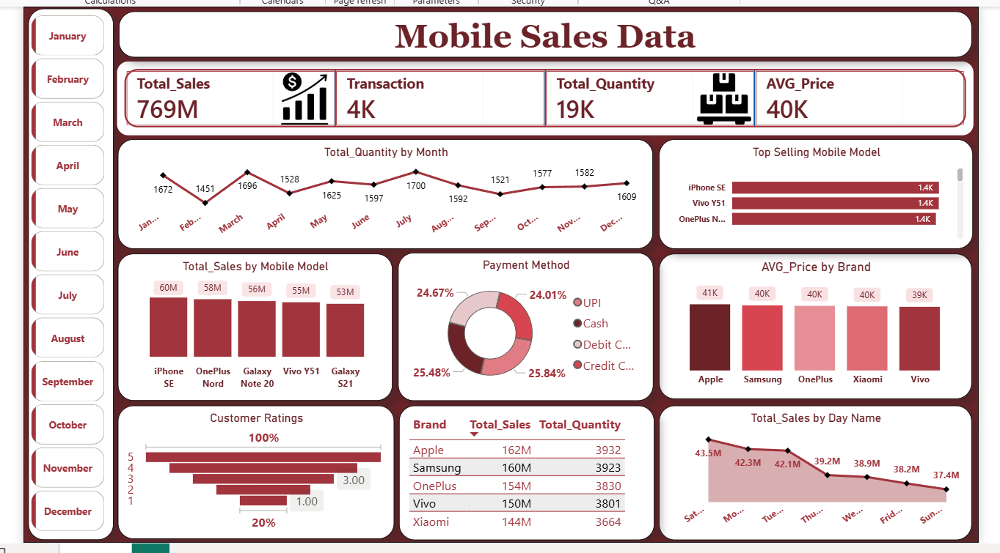

# Mobile-Sales-Analysis-PowerBI

## Project Overview
This Power BI dashboard analyzes mobile sales data and provides insights into sales performance, customer ratings, payment methods, and top-selling mobile models.

## Dashboard Screenshot

## Tools Used
- Power BI
- Excel
- DAX

## Key KPIs
- Total Sales
- Total Transactions
- Total Quantity Sold
- Average Price

## Dashboard Features
- Monthly Sales Trend
- Brand-wise Sales Analysis
- Top Selling Mobile Models
- Payment Method Analysis
- Customer Rating Analysis
- Interactive Slicers

## 📌 Key Insights
- 📱 **Samsung** top selling brand
- 💳 **UPI** most preferred payment method
- 📈 **Q4** highest sales quarter
- ⭐ Average customer rating: **4.2/5**

  ## 🎯 Business Impact
This dashboard helps businesses:
- Identify top-performing mobile brands
- Understand customer payment preferences
- Track monthly & quarterly sales trends
- Make data-driven inventory decisions

